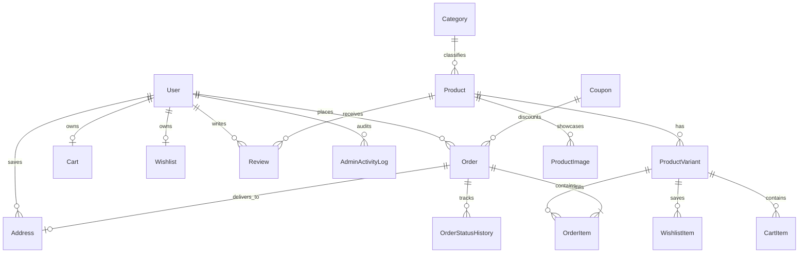

# Database Architecture & Schema Documentation

## 1. Overview
The ABXV store uses **PostgreSQL hosted on Neon** managed through **Prisma ORM (v7)**. 

* **Runtime Connection:** Neon PgBouncer pooled connection (`DATABASE_URL`) with container limit `max: 2`.
* **CLI & Migrations Connection:** Direct unpooled TCP connection (`DIRECT_URL` / `DATABASE_URL_UNPOOLED`).

---

## 2. Core Entity Relationship Diagram

---

## 3. Key Tables & Models

### `users`
* Manages customer credentials and administrative privileges.
* `role`: Enum (`CUSTOMER`, `ADMIN`, `USER`).
* Authentication managed through Auth.js / NextAuth v5 with bcrypt password hashing.

### `password_reset_tokens`
* Secure single-use tokens for customer account recovery.
* 60-minute automated expiration.

### `categories` & `products`
* E-commerce catalog hierarchy with slug routing and soft deletion (`deletedAt`).
* Products contain SEO metadata (`metaTitle`, `metaDescription`, `ogImage`) and brand attributes.

### `product_variants`
* Distinct SKU SKU-level inventory with size, color, unit price, and real-time stock counters.
* Stock decrement occurs inside transactional database locks (`SELECT ... FOR UPDATE`) during checkout.

### `orders` & `order_items`
* Multi-currency orders (`NPR`, `USD`, `GBP`).
* Financial tracking: `subtotal`, `shipping`, `tax`, `discount`, `total`, `exchangeRate`.
* Integrates with `stripePaymentIntentId` and `khaltiPidx`.
* Payment statuses: `PENDING`, `PAID`, `FAILED`, `REFUNDED`.

### `coupons`
* Promotional discounts with support for `PERCENTAGE` and `FIXED_AMOUNT`.
* Usage controls: `minSubtotal`, `maxUses`, `usedCount`, `expiresAt`, `isActive`.

### `admin_activity_logs`
* Audit logging for administrative actions (stock updates, refunds, order fulfillment transitions, review deletion).
